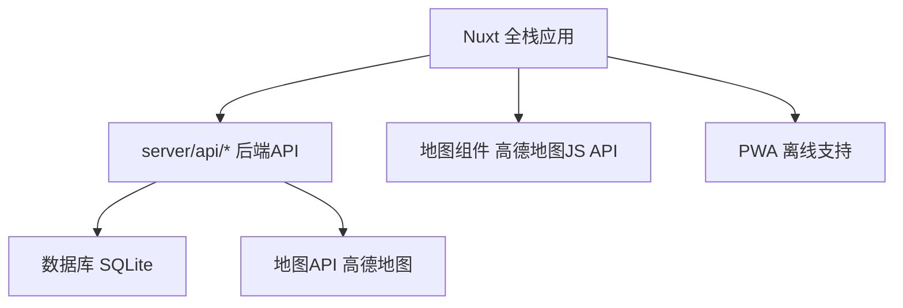

# 设计文档

## 概述

个人配送路径优化系统是一个基于 Nuxt 的全栈应用。前端负责用户交互和地图展示，后端 API 通过 Nuxt 的 server 目录实现，负责路径优化计算和数据存储。系统集成第三方地图 API 获取实际路况和距离信息，使用启发式算法解决旅行商问题的变种，为个人商家提供最优配送路线。

## 架构

### 整体架构



### 技术栈选择

**前端：**

- Nuxt + Vue + TypeScript - 全栈框架，SEO 友好
- shadcn-vue - 现代化高质量 UI 组件库
- 高德地图 JavaScript API - 地图展示和交互
- PWA - 支持移动端离线使用

**后端：**

- Nuxt Server API - 内置全栈 API 支持
- TypeScript - 类型安全
- SQLite + Drizzle ORM - 轻量级数据库和现代化 ORM
- 高德地图 Web API - 距离计算和地理编码

## 组件和接口

### 前端组件架构


### API 接口设计

**Nuxt Server API 路由结构：**

```
server/
├── api/
│   ├── orders/
│   │   ├── index.get.ts     # GET /api/orders
│   │   ├── index.post.ts    # POST /api/orders
│   │   └── [id].put.ts      # PUT /api/orders/:id
│   │   └── [id].delete.ts   # DELETE /api/orders/:id
│   ├── routes/
│   │   └── optimize.post.ts # POST /api/routes/optimize
│   ├── geocode.post.ts      # POST /api/geocode
│   └── addresses/
│       └── frequent.get.ts  # GET /api/addresses/frequent
│       └── frequent.post.ts # POST /api/addresses/frequent
```

**订单管理接口：**

```typescript
// 创建订单 - server/api/orders/index.post.ts
export default defineEventHandler(async (event) => {
  const body = await readBody(event);
  // 处理订单创建逻辑
});

// 获取订单列表 - server/api/orders/index.get.ts
export default defineEventHandler(async (event) => {
  const query = getQuery(event);
  // 处理订单查询逻辑
});
```

**路线优化接口：**

```typescript
// 计算最优路线
POST / api / routes / optimize;
{
  startLocation: {
    lat: number;
    lng: number;
    address: string;
  }
  destinations: Array<{
    id: string;
    lat: number;
    lng: number;
    address: string;
  }>;
}

// 响应
{
  optimizedRoute: Array<{
    orderId: string;
    sequence: number;
    address: string;
    distance: number; // 到下一点的距离(米)
    duration: number; // 到下一点的时间(秒)
  }>;
  totalDistance: number;
  totalDuration: number;
}
```

**地址管理接口：**

```typescript
// 地理编码
POST /api/geocode
{
  address: string;
}

// 响应
{
  lat: number;
  lng: number;
  formattedAddress: string;
}

// 获取常用地址
GET /api/addresses/frequent

// 保存常用地址
POST /api/addresses/frequent
{
  address: string;
  alias?: string;
}
```

## 数据模型

### 数据库表设计

```sql
-- 订单表
CREATE TABLE orders (
  id INTEGER PRIMARY KEY AUTOINCREMENT,
  address TEXT NOT NULL,
  lat REAL,
  lng REAL,
  customer_name TEXT,
  items TEXT,
  notes TEXT,
  status TEXT DEFAULT 'pending', -- pending, completed
  created_at DATETIME DEFAULT CURRENT_TIMESTAMP,
  completed_at DATETIME
);

-- 配送记录表
CREATE TABLE delivery_sessions (
  id INTEGER PRIMARY KEY AUTOINCREMENT,
  start_location TEXT NOT NULL,
  start_lat REAL,
  start_lng REAL,
  total_distance INTEGER, -- 米
  total_duration INTEGER, -- 秒
  order_count INTEGER,
  created_at DATETIME DEFAULT CURRENT_TIMESTAMP,
  completed_at DATETIME
);

-- 配送路线表
CREATE TABLE delivery_routes (
  id INTEGER PRIMARY KEY AUTOINCREMENT,
  session_id INTEGER,
  order_id INTEGER,
  sequence INTEGER,
  distance_to_next INTEGER,
  duration_to_next INTEGER,
  FOREIGN KEY (session_id) REFERENCES delivery_sessions(id),
  FOREIGN KEY (order_id) REFERENCES orders(id)
);

-- 常用地址表
CREATE TABLE frequent_addresses (
  id INTEGER PRIMARY KEY AUTOINCREMENT,
  address TEXT NOT NULL,
  alias TEXT,
  lat REAL,
  lng REAL,
  usage_count INTEGER DEFAULT 1,
  last_used DATETIME DEFAULT CURRENT_TIMESTAMP
);
```

### TypeScript 类型定义

```typescript
interface Order {
  id: string;
  address: string;
  lat?: number;
  lng?: number;
  customerName: string;
  items: string;
  notes?: string;
  status: "pending" | "completed";
  createdAt: Date;
  completedAt?: Date;
}

interface Location {
  lat: number;
  lng: number;
  address: string;
}

interface RoutePoint extends Location {
  orderId: string;
  sequence: number;
  distanceToNext?: number;
  durationToNext?: number;
}

interface OptimizedRoute {
  points: RoutePoint[];
  totalDistance: number;
  totalDuration: number;
}

interface DeliverySession {
  id: string;
  startLocation: Location;
  orders: Order[];
  route?: OptimizedRoute;
  createdAt: Date;
  completedAt?: Date;
}
```

## 错误处理

### 前端错误处理

1. **网络错误：** 显示友好的错误提示，支持重试机制
2. **地址解析失败：** 提示用户重新输入或选择地图点击
3. **定位失败：** 降级到手动输入地址
4. **路线计算超时：** 显示进度条，支持取消操作

### 后端错误处理

1. **地图 API 限流：** 实现请求队列和重试机制
2. **地址无效：** 返回具体的错误信息和建议
3. **数据库错误：** 记录日志，返回通用错误信息
4. **路线计算失败：** 降级到简单的距离排序算法

### 错误码定义

```typescript
enum ErrorCode {
  INVALID_ADDRESS = "INVALID_ADDRESS",
  GEOCODING_FAILED = "GEOCODING_FAILED",
  ROUTE_CALCULATION_FAILED = "ROUTE_CALCULATION_FAILED",
  LOCATION_ACCESS_DENIED = "LOCATION_ACCESS_DENIED",
  NETWORK_ERROR = "NETWORK_ERROR",
  DATABASE_ERROR = "DATABASE_ERROR",
}
```

## 路径优化算法

### 算法选择策略

```typescript
function selectOptimizationAlgorithm(pointCount: number): OptimizationStrategy {
  if (pointCount <= 8) {
    return "DYNAMIC_PROGRAMMING"; // 精确解
  } else if (pointCount <= 15) {
    return "NEAREST_NEIGHBOR_WITH_2OPT"; // 启发式 + 局部优化
  } else {
    return "GENETIC_ALGORITHM"; // 元启发式
  }
}
```

### 最近邻算法 + 2-opt 优化

```typescript
class RouteOptimizer {
  // 最近邻算法构建初始路线
  private nearestNeighborTSP(distanceMatrix: number[][]): number[] {
    const n = distanceMatrix.length;
    const visited = new Array(n).fill(false);
    const route = [0]; // 从起点开始
    visited[0] = true;

    for (let i = 1; i < n; i++) {
      let nearest = -1;
      let minDistance = Infinity;

      for (let j = 0; j < n; j++) {
        if (!visited[j] && distanceMatrix[route[i - 1]][j] < minDistance) {
          minDistance = distanceMatrix[route[i - 1]][j];
          nearest = j;
        }
      }

      route.push(nearest);
      visited[nearest] = true;
    }

    return route;
  }

  // 2-opt局部优化
  private twoOptImprove(route: number[], distanceMatrix: number[][]): number[] {
    let improved = true;
    let bestRoute = [...route];

    while (improved) {
      improved = false;

      for (let i = 1; i < route.length - 2; i++) {
        for (let j = i + 1; j < route.length; j++) {
          const newRoute = this.twoOptSwap(bestRoute, i, j);

          if (
            this.calculateRouteDistance(newRoute, distanceMatrix) <
            this.calculateRouteDistance(bestRoute, distanceMatrix)
          ) {
            bestRoute = newRoute;
            improved = true;
          }
        }
      }
    }

    return bestRoute;
  }
}
```

### 集成测试

1. **地图 API 集成：**

   - 地理编码准确性
   - 距离计算准确性
   - API 限流处理

2. **前后端集成：**
   - 数据流完整性
   - 错误传播
   - 状态同步

### 端到端测试

1. **完整配送流程：**
   - 添加订单 → 优化路线 → 开始配送 → 完成配送
   - 多设备兼容性
   - 离线功能测试

### 性能测试

1. **路线计算性能：**

   - 不同订单数量的响应时间
   - 内存使用情况
   - 并发处理能力

2. **地图渲染性能：**
   - 大量标记点的渲染
   - 路线绘制流畅度
   - 移动端性能
